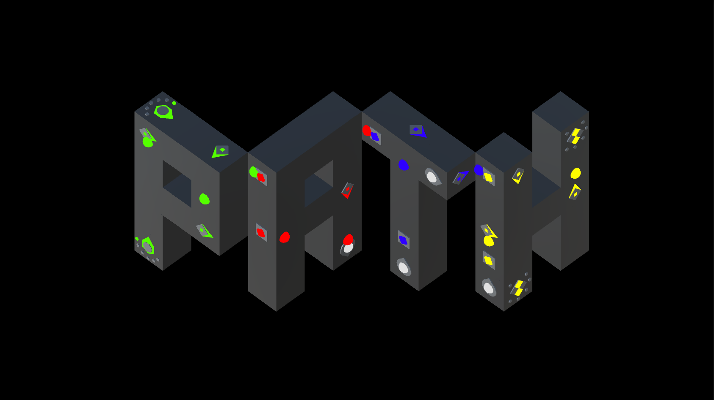

# Path

OVERVIEW
--------------------------------------------------
The purpose of this project was to bring an original game idea from concept to life for the [Game Development] course. It was made at the Computer Science undergraduate program from University of São Paulo (ICMC - USP).

At the end of the game development course there was a Workshop in which students exposed their projects to the public.

PROJECT
--------------------------------------------------
The game belongs to the puzzle style, focusing on logic, reasoning, spatial vision, trial and error. In this game, the player must overcome mental challenges where too many wrong solutions are possible, and a very small number of right solutions are possible. Unlike many puzzles, in this game time is not a problem, there is no need for major reflexes in the player's actions and there is no time limit to complete a level. It is expected that the player spends a little time on each level to understand it, and a reasonable time to solve it. The game rewards the player who has an intelligent view of the solution of the problem not wasting much time on one level, progressing faster and thus feeling rewarded.

CONTENT
--------------------------------------------------
* Ten Pager GDD (Game Design Document) concept model
* Music and Sound Effects (Made with FL Studio using a Korg MIDI Controller Keyboard)
* Sprites, Textures, Head-up Display (Made with Adobe Photoshop)
* Meshes (Made with Autodesk 3D Studio Max)

The game was implemented in Unity 3D in C# language.

PREVIEW
--------------------------------------------------
You can check the first level [song] and the Workshop [video]

WHERE IS THE GAME?
--------------------------------------------------
This project is proprietary, therefore this page was done just as part of my portfolio.

CREDITS
--------------------------------------------------
- André Miguel Coelho Leite
- Andreas Munte Foerster
- Guilherme Muzzi da Rocha
- Rafael Gallo
- Wesley Tiozzo

MORE INFO
--------------------------------------------------
ICMC's Game Workshop: <https://www.icmc.usp.br/en/noticias/2663-veja-como-foi-a-mostra-de-jogos-digitais>

[song]: https://soundcloud.com/user-736545459
[video]: https://www.youtube.com/watch?v=w1t0OeHrqAk
